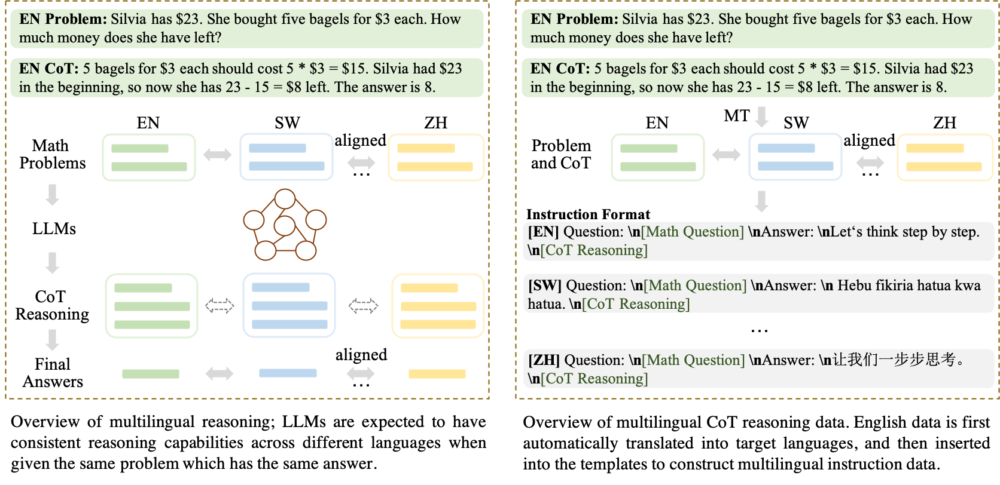
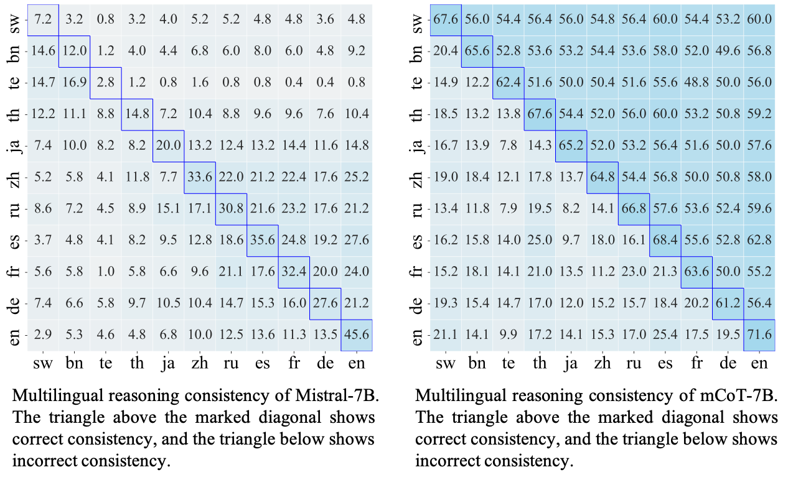

# [mCoT: Multilingual Instruction Tuning for Reasoning Consistency in Language Models (ACL 2024)](https://arxiv.org/abs/2406.02301)

> **Abstract:**
Large language models (LLMs) with Chain-of-thought (CoT) have recently emerged as a powerful technique for eliciting reasoning to improve various downstream tasks. As most research mainly focuses on English, with few explorations in a multilingual context, the question of how reliable this reasoning capability is in different languages is still open. To address it directly, we study multilingual reasoning consistency across multiple languages, using popular open-source LLMs. First, we compile the first large-scale multilingual math reasoning dataset, mCoT-MATH, covering eleven diverse languages. Then, we introduce multilingual CoT instruction tuning to boost reasoning capability across languages, thereby improving model consistency. While existing LLMs show substantial variation across the languages we consider, and especially low performance for lesser resourced languages, our 7B parameter model mCoT achieves impressive consistency across languages, and superior or comparable performance to close- and open-source models even of much larger sizes.

## Overview



## 🤗 Dataset: [mCoT-MATH](https://huggingface.co/datasets/laihuiyuan/mCoT-MATH)

Based on [MetaMathQA](https://github.com/meta-math/MetaMath) and [MathInstruct](https://github.com/TIGER-AI-Lab/MAmmoTH)
, we compile [mCoT-MATH](https://huggingface.co/datasets/laihuiyuan/mCoT-MATH), the first large-scale multilingual math
CoT reasoning dataset containing around 6.3 million samples for 11 diverse languages.

| Language  | SW    | BN    | TE    | TH    | JA    | ZH    | RU    | ES    | FR    | DE    | EN    |Overall |
|:----------|:------|:------|:------|:------|:------|:------|:------|:------|:------|:------|:------|--------|
| mCoT-MATH | ~580K | ~580K | ~580K | ~580K | ~580K | ~580K | ~580K | ~580K | ~580K | ~580K | ~580K | ~6.3M  |

## 🤗 Model: [mCoT](https://huggingface.co/laihuiyuan/mCoT)

Based on mCoT-MATH, we finetune Mistral-7B for multilingual math reasoning, which achieves impressive consistency across
languages. We assess mCoT on two popular multilingual datasets: [MGSM](https://arxiv.org/abs/2210.03057v1) 
and [MSVAMP](https://arxiv.org/abs/2310.20246), and then measure multilingual reasoning consistency of Mistral-7B and mCoT.

### Results on [MGSM](https://arxiv.org/abs/2210.03057v1)
| Language               | SW   | BN   | TE   | TH   | JA   | ZH   | RU   | ES   | FR   | DE   | EN   | 
|:-----------------------|:-----|:-----|:-----|:-----|:-----|:-----|:-----|:-----|:-----|:-----|:-----|
| GPT-3 few-shot         | 11.2 | 6.4  | 0.4  | 0.8  | 26.0 | 40.0 | 28.4 | 40.4 | 37.6 | 36.0 | 53.6 |
| GPT-3.5-En 2-shot      | 40.0 | 7.6  | -    | 15.6 | 46.8 | 52.8 | 50.4 | 61.2 | 59.2 | 62.0 | 67.2 |
| GPT4-En 2-shot         | 64.4 | 17.6 | -    | 40.4 | 71.6 | 70.0 | 64.0 | 71.2 | 72.0 | 73.6 | 80.0 |
| PaLM-540B few-shot     | 35.2 | 46.0 | 45.6 | 52.8 | 40.0 | 46.8 | 48.4 | 56.8 | 46.4 | 49.2 | 62.4 |
| WizardMath-7B          | 3.4  | 2.0  | -    | 4.0  | 24.0 | 22.4 | 30.8 | 34.8 | 30.4 | 30.4 | 47.6 |
| MathOctopus-7B         | 38.4 | 33.2 | -    | 36.4 | 35.6 | 45.2 | 48.4 | 45.2 | 38.0 | 43.6 | 54.8 |
| MathOctopus-Mistral-7B | 51.6 | 44.0 | -    | 48.8 | 48.0 | 51.6 | 49.6 | 53.2 | 47.2 | 50.0 | 58.4 |
| xCoT-7B                | 48.4 | 40.4 | 42.8 | 49.2 | 50.0 | 50.0 | 50.0 | 48.8 | 49.6 | 47.2 | 48.4 |
| WizardMath-13B         | 5.6  | 6.4  | -    | 5.6  | 22.0 | 28.0 | 34.4 | 45.6 | 42.0 | 40.4 | 52.8 |
| MathOctopus-13B        | 46.0 | 42.0 | -    | 46.0 | 39.6 | 51.2 | 47.6 | 53.2 | 49.6 | 49.2 | 51.6 |
| xCoT-13B               | 51.6 | 50.0 | 47.2 | 50.0 | 49.6 | 54.0 | 56.8 | 54.8 | 46.4 | 52.4 | 54.4 |
| mCoT-7B                | 67.2 | 65.6 | 62.4 | 67.6 | 65.2 | 64.8 | 66.8 | 68.4 | 63.8 | 61.2 | 71.6 |


### Results on [MSVAMP](https://arxiv.org/abs/2310.20246)
| Language               | SW   | BN   | TH   | JA   | ZH   | RU   | ES   | FR   | DE   | EN   | AVG  | 
|:-----------------------|:-----|:-----|:-----|:-----|:-----|:-----|:-----|:-----|:-----|:-----|:-----|
| GPT-3.5-En zero-shot   | 63.2 | 3.1  | 24.4 | 63.3 | 72.4 | 62.3 | 69.5 | 71.9 | 66.7 | 76.1 | 57.3 |
| GPT-3.5-En 2-shot      | 68.4 | 14.4 | 46.0 | 74.0 | 78.4 | 70.9 | 74.6 | 78.2 | 73.9 | 81.2 | 66.0 |
| GPT4-En 2-shot         | 75.7 | 31.2 | 68.1 | 74.8 | 78.9 | 77.9 | 81.5 | 83.9 | 78.1 | 80.1 | 73.0 |
| PaLM-540B few-shot     | 35.2 | 46.0 | 45.6 | 52.8 | 40.0 | 46.8 | 48.4 | 56.8 | 46.4 | 49.2 | 62.4 |
| WizardMath-7B          | 10.3 | 16.1 | 6.3  | 26.7 | 26.8 | 33.7 | 42.9 | 39.9 | 39.6 | 45.1 | 27.0 |
| MathOctopus-7B         | 42.3 | 32.8 | 40.5 | 43.2 | 43.2 | 42.1 | 44.5 | 45.3 | 43.1 | 46.8 | 42.4 |
| MathOctopus-Mistral-7B | 41.2 | 36.7 | 40.2 | 41.5 | 43.1 | 44.0 | 47.0 | 49.0 | 46.4 | 49.7 | 43.9 |
| WizardMath-13B         | 12.5 | 13.7 | 16.3 | 29.5 | 37.0 | 43.8 | 50.4 | 49.4 | 48.7 | 56.3 | 35.8 |
| MathOctopus-13B        | 43.4 | 34.2 | 39.5 | 43.1 | 46.4 | 48.2 | 48.2 | 49.9 | 47.7 | 44.6 | 44.5 |
| mCoT-7B                | 55.0 | 53.7 | 56.4 | 58.8 | 58.2 | 58.1 | 58.9 | 58.8 | 61.1 | 58.3 | 57.7 |


### Multilingual Reasoning Consistency on MGSM



## Prompt Template

```bash
# Template
template = "Question:\n{question}\nAnswer:\n{language}\n"

# Language prompt
bn = "আসুন ধাপে ধাপে চিন্তা করি।"
de = "Denken wir Schritt für Schritt."
en = "Let's think step by step."
es = "Pensemos paso a paso."
fr = "Réfléchissons étape par étape."
ja = "段階的に考えてみましょう。"
ru = "Давайте думать поэтапно."
sw = "Hebu fikiria hatua kwa hatua."
te = "అంచెలంచెలుగా ఆలోచిద్దాం."
th = "ลองคิดทีละขั้นตอน"
zh = "让我们一步步思考。"

# Math question
math_en = "A robe takes 2 bolts of blue fiber and half that much white fiber.  How many bolts in total does it take?"

# An example for the English question
prompt = template.format(question=math_en, language=en)
```

## Citation
If you use any content from this repository, please cite our paper:
```
@inproceedings{lai-etal-2024-mcot,
    title = "mCoT: Multilingual Instruction Tuning for Reasoning Consistency
    in Language Models",
    author = "Lai, Huiyuan and Nissim, Malvina",
    booktitle = "Proceedings of the 62nd Annual Meeting of the Association
    for Computational Linguistics,
    month = aug,
    address = "Bangkok, Thailand",
    year = "2024",
    publisher = "Association for Computational Linguistics"
}
```
